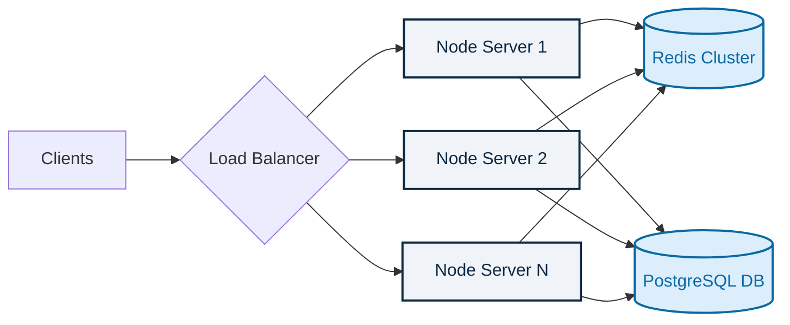
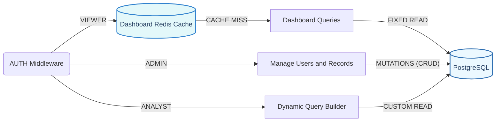

# Financial Dashboard API 📊

A robust, enterprise-ready backend API serving financial dashboard records, managing users, computing analytics, and securely separating data access through strict Role-Based Access Control (RBAC).

---

## 🏗 System Architecture

### High-Level Design (HLD): Cloud Scaling Readiness
To support enterprise/B2B usage where we may serve high volumes of requests and process heavy analytical aggregations, the system splits application layers (compute) from persistent layers (storage). Using a Load Balancer ensures scaling horizontally remains seamless.

### Low-Level Design (LLD): RBAC Middleware Flow
Traffic is explicitly guarded and shaped via JWT token inspection. Routing behaves uniquely depending on session claims.

---

## 🚀 Tech Stack
- **Node.js + Express**: Core event-driven HTTP processing.
- **PostgreSQL**: Relational precision dataset mapping.
- **Redis (ioredis)**: In-memory structured caching for Dashboard Analytics.
- **Swagger**: Dynamically updating interactive frontend mapping (`/api-docs`).
- **Jest/Supertest**: Continuous isolated testing suite. 

---

## 🛠 Design Decisions & Assumptions

### 1. B2B Multi-Tenant Scalability & Tradeoffs
If this backend pivots to serving multiple businesses (B2B multi-tenancy), the architecture explicitly relies on Load Balancers directing traffic to transient Node.js nodes. 
- **Redis Clustering:** To maintain cache consistency across parallel Node.js instances, distributed Redis caching is required instead of local `.Map()` storage. If B2B companies share a Redis pool, we must append a `TenantID` namespace string to all keys.
- **Database Tradeoff (Row-Level Security vs Database-per-Tenant):** We currently use a single PostgreSQL instance. To securely scale B2B, either *Row-Level Security (RLS)* must be enabled with `company_id` injected into every table, OR we spin up isolated DB schemas per company. The latter provides better noisy-neighbor isolation but drastically increases infrastructure costs.

### 2. Database Indexing Strategy
To ensure that complex analytical aggregations and dashboard paginations execute immediately, several explicit `B-Tree` indexes were crafted inside the PostgreSQL schema models, avoiding expensive linear sequential scans:
- **`idx_records_date`, `idx_records_category`, `idx_records_type`**: Allows Admin queries and Analyst filter sweeps to slice subsets in `O(log N)` time.
- **Compound Index (`is_deleted, date DESC, id DESC`)**: Ensures queries parsing the primary Dashboard or requesting pagination arrays immediately utilize pre-sorted indexes rather than performing expensive `ORDER BY` runtime sorts.
- **`idx_users_role`**: Ensures mapping role-based access audits scans optimally.

### 3. Missing Periods in Data Delivery 
Time-based trend queries (e.g., `getMonthlyTrends`) only return PostgreSQL rows for periods that actually contain metadata. To keep server payloads slim, the backend drops empty weeks/months. **The frontend application must pad array gaps with `$0` metrics for continuous charting.**

### 4. Floating Point Safeties 
Calculations from PostgreSQL's `NUMERIC` types natively output as generic text strings via the JS `pg` driver to prevent accidental loss of strict financial precision. We parse these to fixed dual-decimal points exclusively right before sending them to the user.

### 5. Caching Volatility
The `Viewer` dashboard defaults its heavy financial calculations to `Redis`. Any mutations triggered by `Admin` roles (Add, Update, Delete) automatically dispatch cache invalidation signals (`invalidateCache`) for the overarching `DASHBOARD_KEY` to ensure total consistency instantly without requiring a TTl-timeout (Time To Live).
